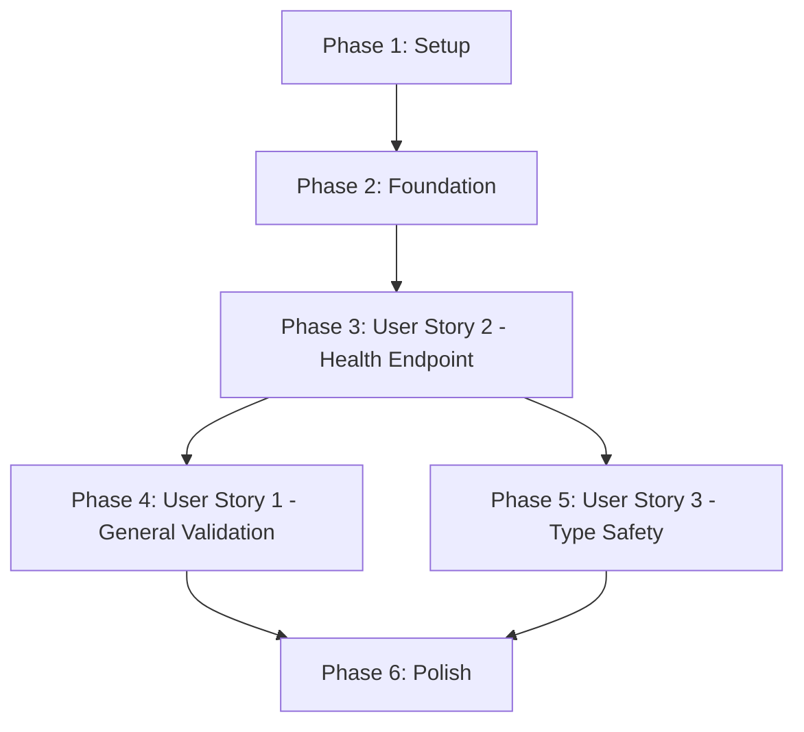

# Tasks: Pydantic Data Validation

**Feature Branch**: `002-pydantic-validation`  
**Input**: Design documents from `/specs/002-pydantic-validation/`  
**Prerequisites**: plan.md ✅, spec.md ✅, research.md ✅, data-model.md ✅, contracts/ ✅

**Tests**: Unit tests included as per TDD approach - write tests first, then implement

**Organization**: Tasks are grouped by user story (US1, US2, US3) to enable independent implementation and testing

## Format: `- [ ] [ID] [P?] [Story] Description with file path`

- **[P]**: Can run in parallel (different files, no dependencies)
- **[Story]**: Which user story this task belongs to (US1, US2, US3)
- All paths are absolute from repository root

---

## Phase 1: Setup (Shared Infrastructure)

**Purpose**: Create directory structure for Pydantic models

- [X] T001 Create models directory structure at repository root: `models/__init__.py`
- [X] T002 Create schemas module file: `models/schemas.py` (empty file, will be populated in user story phases)

**Checkpoint**: Directory structure ready for model implementation

---

## Phase 2: Foundational (Blocking Prerequisites)

**Purpose**: No foundational tasks required - FastAPI and Pydantic are already configured

**⚠️ CRITICAL**: This phase is empty because:
- FastAPI 0.115.11 already includes Pydantic V2 (zero new dependencies per constitution)
- No database or external services needed (validation is in-memory)
- Existing test infrastructure (pytest, FastAPI TestClient) is sufficient

**Checkpoint**: Foundation ready - can proceed directly to user story implementation

---

## Phase 3: User Story 2 - Health Endpoint Response Model (Priority: P2) 🎯 MVP

**Goal**: Update existing `/health` endpoint to use Pydantic HealthResponse model with strict validation

**Why P2 before P1**: This user story modifies the existing health endpoint to demonstrate Pydantic validation in the simplest possible scenario. It establishes the pattern before tackling the more general API validation story.

**Independent Test**: 
1. Request `/health` endpoint → returns `{"status": "ok"}` with HTTP 200
2. Send request with extra query params → returns HTTP 422 (strict mode rejects extra fields)
3. View `/docs` → HealthResponse schema visible in OpenAPI documentation
4. Run `make type-check` → no type errors

### Tests for User Story 2 (TDD: Write First, Watch Fail)

- [X] T003 [P] [US2] Create test file `tests/unit/test_health_validation.py` with test for HealthResponse model instantiation
- [X] T004 [P] [US2] Add test in `tests/unit/test_health_validation.py` for strict mode (extra fields rejected)
- [X] T005 [P] [US2] Add test in `tests/unit/test_health_validation.py` for health endpoint response validation
- [X] T006 [P] [US2] Add test in `tests/unit/test_health.py` for OpenAPI schema presence (check response_model)

**⚠️ RUN TESTS**: Execute `make test` - all new tests should FAIL (models not implemented yet)

### Implementation for User Story 2

- [X] T007 [US2] Implement HealthResponse model in `models/schemas.py` with ConfigDict(extra='forbid')
- [X] T008 [US2] Update health endpoint in `main.py` to use response_model=HealthResponse
- [X] T009 [US2] Add import statement in `main.py`: `from models.schemas import HealthResponse`
- [X] T010 [US2] Update `models/__init__.py` to export HealthResponse for easy imports

**⚠️ RUN TESTS**: Execute `make test` - all tests should now PASS

### Verification for User Story 2

- [X] T011 [US2] Run `make dev` and verify `/docs` shows HealthResponse schema in Swagger UI
- [X] T012 [US2] Run `curl http://localhost:8000/health?unknown=value` and verify HTTP 422 response
- [X] T013 [US2] Run `make type-check` and verify mypy passes with no errors
- [X] T014 [US2] Run `make test` and verify all tests pass in <5s

**Checkpoint**: Health endpoint now uses Pydantic validation with strict mode. OpenAPI docs auto-generated. Tests pass.

---

## Phase 4: User Story 1 - API Request/Response Validation (Priority: P1)

**Goal**: Demonstrate general Pydantic validation patterns for request/response data with comprehensive test coverage

**Why after US2**: Now that health endpoint shows basic pattern, this story documents and tests the full validation behavior including nested structures, type coercion, and error messages.

**Independent Test**:
1. Create test models with various field types (string, int, nested)
2. Test valid data → models instantiate correctly
3. Test invalid data → clear ValidationErrors with field paths
4. Test type coercion → compatible types auto-convert
5. Test extra fields → HTTP 422 in strict mode

### Tests for User Story 1 (TDD: Write First, Watch Fail)

- [X] T015 [P] [US1] Create test file `tests/unit/test_pydantic_validation.py` for general validation tests
- [X] T016 [P] [US1] Add test in `tests/unit/test_pydantic_validation.py` for valid request data acceptance
- [X] T017 [P] [US1] Add test in `tests/unit/test_pydantic_validation.py` for invalid type rejection (wrong field types)
- [X] T018 [P] [US1] Add test in `tests/unit/test_pydantic_validation.py` for missing required fields
- [X] T019 [P] [US1] Add test in `tests/unit/test_pydantic_validation.py` for type coercion (string to int, int to string)
- [X] T020 [P] [US1] Add test in `tests/unit/test_pydantic_validation.py` for extra fields rejection in strict mode
- [X] T021 [P] [US1] Add test in `tests/unit/test_pydantic_validation.py` for nested validation errors with field paths
- [X] T022 [P] [US1] Add test in `tests/unit/test_pydantic_validation.py` for multiple simultaneous validation errors

**⚠️ RUN TESTS**: Execute `make test` - new tests should FAIL (test data structures not created yet)

### Implementation for User Story 1

- [X] T023 [US1] Create example request/response models in `models/schemas.py` for testing validation patterns
- [X] T024 [US1] Document validation error structure in docstrings of `models/schemas.py`
- [X] T025 [US1] Add type hints to all model fields in `models/schemas.py` for IDE support
- [X] T026 [US1] Verify all models use ConfigDict(extra='forbid') for strict validation

**⚠️ RUN TESTS**: Execute `make test` - all tests should now PASS

### Documentation for User Story 1

- [X] T027 [P] [US1] Add docstring to HealthResponse model explaining validation behavior
- [X] T028 [P] [US1] Add inline comments in `models/schemas.py` showing type coercion examples
- [X] T029 [P] [US1] Update `models/__init__.py` docstring to document strict validation mode

**Checkpoint**: Comprehensive validation tests pass. All validation patterns documented. Error messages verified.

---

## Phase 5: User Story 3 - Type Safety and IDE Support (Priority: P3)

**Goal**: Verify type checking integration and developer experience improvements

**Why P3**: This is a quality-of-life improvement for developers. Doesn't add runtime functionality but improves development experience.

**Independent Test**:
1. Run `make type-check` with mypy → passes with zero errors
2. Open code in VS Code with Pylance → field autocompletion works
3. Intentionally add type error → mypy catches it before runtime
4. Check IDE shows field types on hover

### Tests for User Story 3 (Type Checking Validation)

- [X] T030 [P] [US3] Add mypy configuration to `pyproject.toml` if not present (strict mode enabled)
- [X] T031 [P] [US3] Create test script `tests/unit/test_type_checking.py` that intentionally has type errors (commented out)
- [X] T032 [P] [US3] Add test in `tests/unit/test_type_checking.py` for correct type hints on HealthResponse
- [X] T033 [P] [US3] Add test in `tests/unit/test_type_checking.py` for model instantiation with correct types

**⚠️ RUN TESTS**: Execute `make type-check` - should pass for main code, fail for commented type-error examples

### Implementation for User Story 3

- [X] T034 [US3] Review all Pydantic models in `models/schemas.py` have complete type annotations
- [X] T035 [US3] Add type hints to endpoint functions in `main.py` (return type annotations)
- [X] T036 [US3] Verify imports in `models/__init__.py` maintain type information
- [X] T037 [US3] Add `py.typed` marker file to `models/` directory for PEP 561 compliance

### Verification for User Story 3

- [X] T038 [US3] Run `make type-check` and verify zero errors
- [X] T039 [US3] Open `main.py` in VS Code and verify HealthResponse fields show autocompletion
- [X] T040 [US3] Add intentional type error (e.g., `HealthResponse(status=123)`) and verify mypy catches it
- [X] T041 [US3] Remove intentional error and verify all checks pass

**Checkpoint**: Type checking fully functional. IDE provides autocompletion. Developer experience improved.

---

## Phase 6: Polish & Cross-Cutting Concerns

**Purpose**: Final validation, documentation updates, and quality checks

- [X] T042 [P] Update existing `tests/unit/test_health.py` to import from `models.schemas`
- [X] T043 [P] Run full test suite `make test` and verify all tests pass in <5s
- [X] T044 [P] Run `make lint` and verify zero linting errors
- [X] T045 [P] Run `make type-check` and verify mypy passes
- [X] T046 [P] Verify OpenAPI docs at `/docs` show all schemas correctly
- [X] T047 Update README.md (if exists) to mention Pydantic validation feature
- [X] T048 Run `make docker-build && make docker-up` and verify health endpoint works in container
- [X] T049 Verify response time <50ms for health endpoint (measure with `curl` and time command)
- [X] T050 Run final constitution check: zero new dependencies, unit tests only, clean code

**Final Checkpoint**: All user stories complete, tested, and documented. Feature ready for merge.

---

## Task Dependencies & Parallel Execution

### Dependency Graph (User Story Completion Order)



**Sequential Requirements**:
1. Setup (T001-T002) must complete before any user story
2. User Story 2 (T003-T014) should complete before US1 and US3 (establishes pattern)
3. User Story 1 (T015-T029) and User Story 3 (T030-T041) can run in parallel after US2
4. Polish (T042-T050) requires all user stories complete

### Parallel Execution Examples

**Phase 3 (User Story 2) - Parallel Test Creation**:
```bash
# All test files can be created simultaneously (different files)
# Run these in parallel:
- T003: Create tests/unit/test_health_validation.py
- T004: Add strict mode test
- T005: Add response validation test  
- T006: Add OpenAPI schema test
```

**Phase 4 (User Story 1) - Parallel Test Creation**:
```bash
# All validation tests can be added in parallel (independent test functions)
# Run these in parallel:
- T015: Create tests/unit/test_pydantic_validation.py
- T016: Valid data test
- T017: Invalid type test
- T018: Missing field test
- T019: Type coercion test
- T020: Extra fields test
- T021: Nested errors test
- T022: Multiple errors test
```

**Phase 5 (User Story 3) - Parallel Type Check Setup**:
```bash
# Type checking configuration and tests can run in parallel
# Run these in parallel:
- T030: Add mypy config
- T031: Create type checking test file
- T032: Add type hint tests
- T033: Add instantiation tests
```

**Phase 6 (Polish) - Parallel Quality Checks**:
```bash
# Quality checks can run independently
# Run these in parallel:
- T042: Update existing tests
- T043: Run test suite
- T044: Run linting
- T045: Run type checking
- T046: Verify OpenAPI docs
```

---

## Implementation Strategy

### MVP Scope (Recommended First Iteration)

**Minimum Viable Product**: Phase 3 (User Story 2) only
- Tasks T001-T014 (14 tasks)
- Delivers: Health endpoint with Pydantic validation, OpenAPI docs, strict mode
- Time estimate: 1-2 hours
- Validation: Existing health endpoint now type-safe with auto-generated docs

**Rationale**: User Story 2 is the simplest, most concrete implementation. It proves Pydantic integration works and establishes the pattern for all future endpoints. Stories 1 and 3 are primarily validation and documentation of existing behavior.

### Incremental Delivery After MVP

1. **Iteration 2**: Phase 4 (User Story 1) - Add comprehensive validation tests (T015-T029)
2. **Iteration 3**: Phase 5 (User Story 3) - Verify type checking integration (T030-T041)
3. **Iteration 4**: Phase 6 (Polish) - Final quality checks and documentation (T042-T050)

### Independent Testing Criteria

**User Story 2 (Health Endpoint)**:
- ✅ GET /health returns HTTP 200 with {"status": "ok"}
- ✅ Extra query params return HTTP 422
- ✅ OpenAPI docs show HealthResponse schema at /docs
- ✅ make type-check passes

**User Story 1 (General Validation)**:
- ✅ Valid data passes validation
- ✅ Invalid types return HTTP 422 with clear error messages
- ✅ Type coercion works for compatible types
- ✅ Nested errors show full field paths

**User Story 3 (Type Safety)**:
- ✅ mypy type checking passes with zero errors
- ✅ IDE shows field autocompletion
- ✅ Type errors caught at development time

---

## Task Summary

- **Total Tasks**: 50
- **Setup Phase**: 2 tasks (T001-T002)
- **Foundational Phase**: 0 tasks (no prerequisites needed)
- **User Story 2 (P2 - MVP)**: 12 tasks (T003-T014)
- **User Story 1 (P1)**: 15 tasks (T015-T029)
- **User Story 3 (P3)**: 12 tasks (T030-T041)
- **Polish Phase**: 9 tasks (T042-T050)

**Parallel Opportunities**: 28 tasks marked [P] can run in parallel
**Estimated Time**: 3-4 hours total (1-2 hours for MVP)

---

## Format Validation ✅

**Checklist Format Compliance**:
- ✅ All tasks use `- [ ]` markdown checkbox
- ✅ All tasks have sequential Task ID (T001-T050)
- ✅ Parallelizable tasks marked with [P]
- ✅ User story tasks labeled [US1], [US2], [US3]
- ✅ Setup/Foundation/Polish tasks have NO story label
- ✅ All tasks include specific file paths
- ✅ All tasks have clear, actionable descriptions

**Organization Compliance**:
- ✅ Tasks organized by user story (phases 3-5)
- ✅ Each user story has independent test criteria
- ✅ TDD approach: tests written before implementation
- ✅ Dependencies clearly documented
- ✅ Parallel execution examples provided
- ✅ MVP scope identified (User Story 2)

**Constitution Compliance**:
- ✅ Zero new dependencies (Pydantic included with FastAPI)
- ✅ Unit tests only (FastAPI TestClient, no external services)
- ✅ Clean code principles (models in separate directory, type hints)
- ✅ All tasks follow YAGNI (only implement what's specified)
